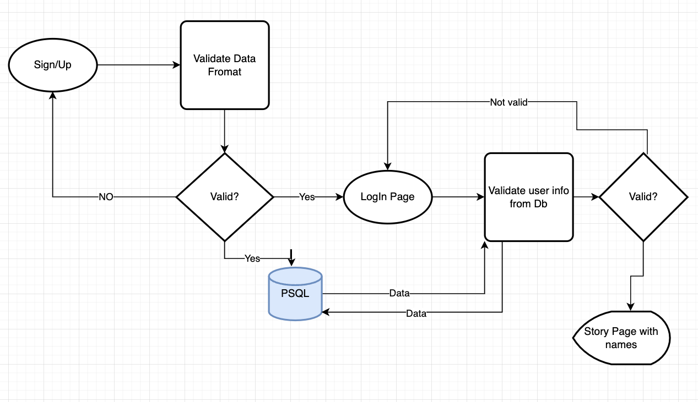

## Problem Statement

- Design an exclusive clubhouse where your members can write anonymous posts.
  Inside the clubhouse, members can see who the author of a post is, but outside they can only see the story and wonder who wrote it.

  ### Scope

  - **Includes**

    - Implement a login - sign up authentecation
    - Implement a function to crate stories.
    - Implement a way to hide the ownership of the story from unauthorized people

  - **Assumptions**

    - users should Enter Name, Email, Password in a valid format.
    - Stories should only be text.

  - **Excludes**

    - Styling might not be the best.

### Use Cases

- users can Sign Up / Login
- Users can create posts, delete them later
- Users who are loged in can see who created a specific post.
- Users who are not loged in can't see who created a post., and should displayed as anonymous

